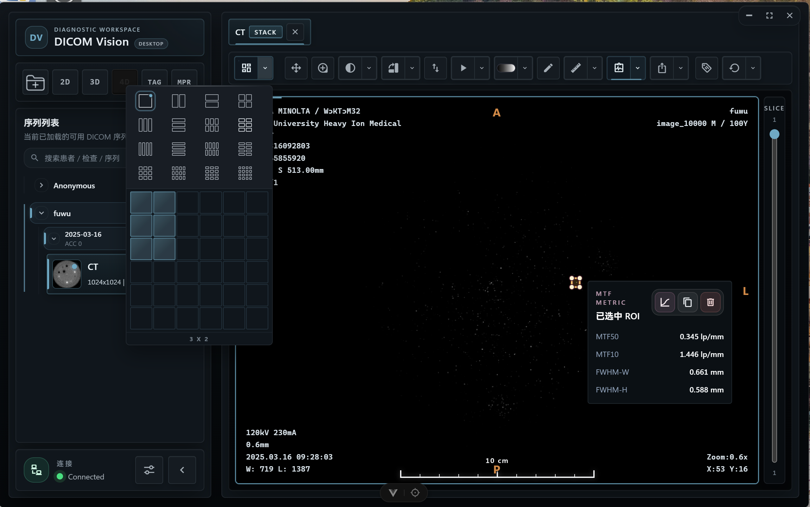
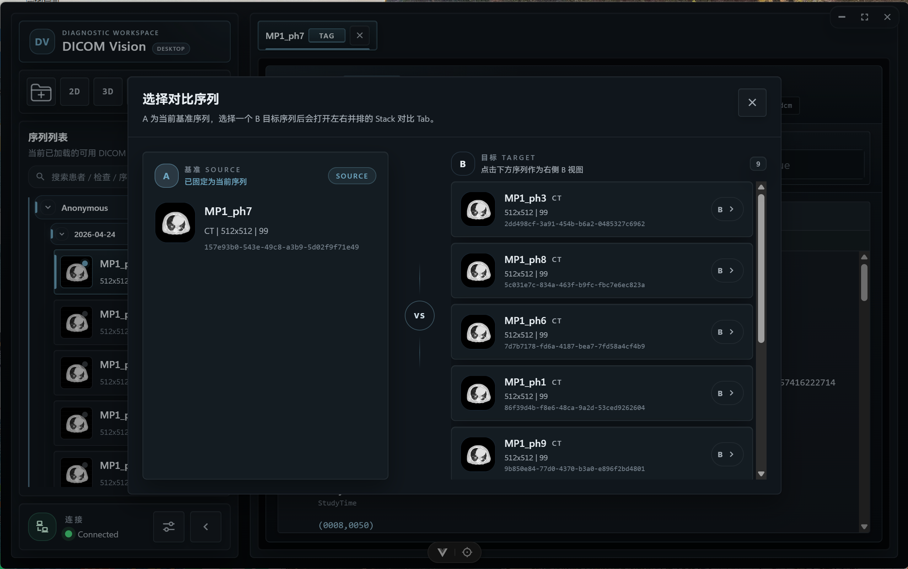
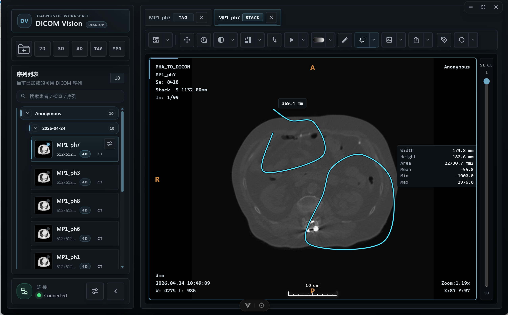
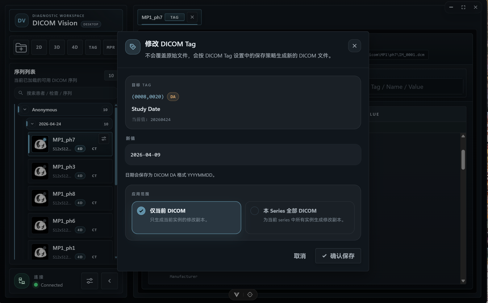
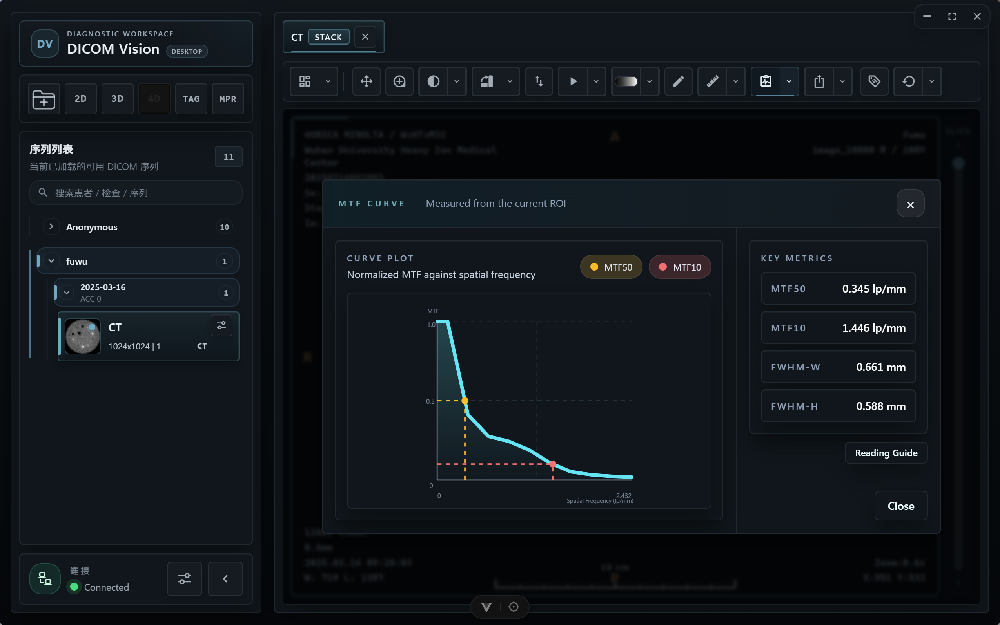
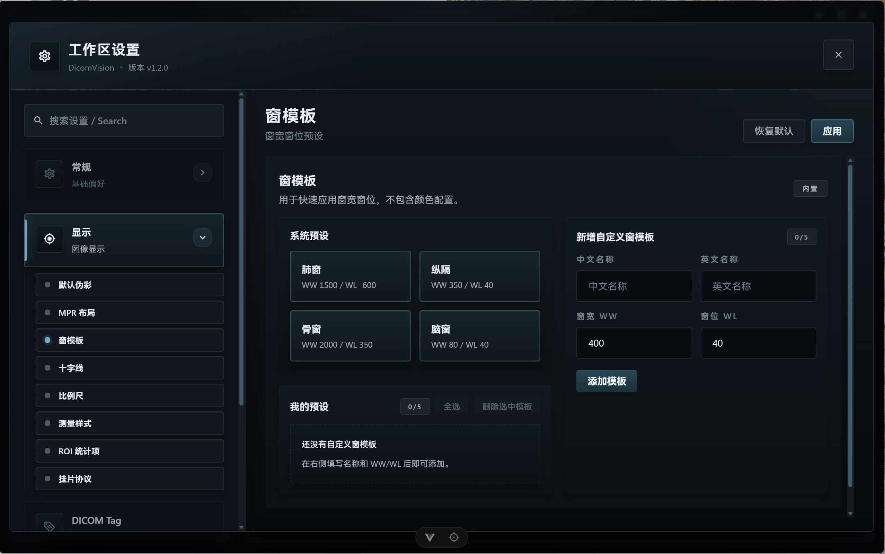
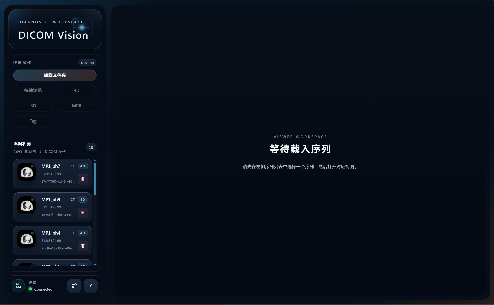
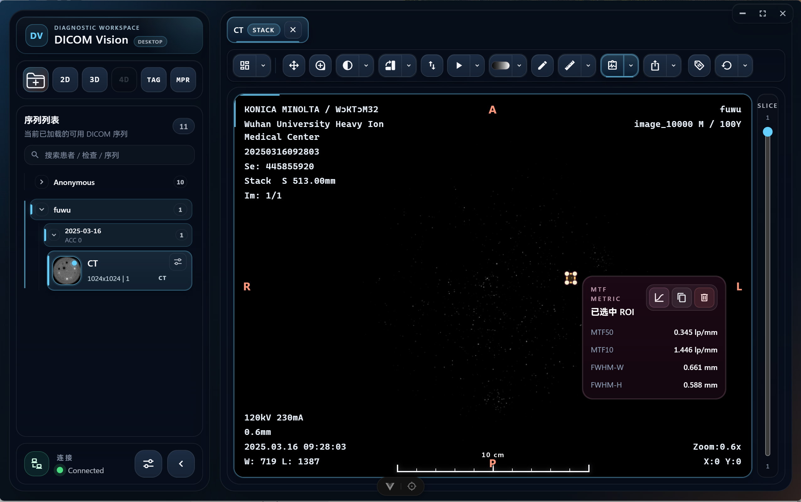

# DicomVision

[中文说明](./README.zh-CN.md)

DicomVision is a client/server DICOM viewer for diagnostic-style browsing, reconstruction, measurement, QA, metadata review, comparison, and privacy-safe export. It provides Stack, MPR/oblique MPR, 3D volume rendering, 4D phase playback, layout workspaces, synchronized comparison, DICOM tag editing, de-identification export, and web or Windows desktop deployment.

## Highlights

- Multi-series workspace with grouped series navigation, drag-and-drop import, tabbed views, and configurable layouts.
- Stack, Compare, MPR, MPR + 3D, 3D volume rendering, and 4D phase workflows.
- Measurement, annotation, MTF/FWHM, and water phantom QA tools for image evaluation.
- DICOM Tag tree browsing, VR-aware editing, batch modification, and de-identification export.
- Theme, layout, pseudocolor, measurement, ROI, export, and Hanging Protocol preferences.

## Feature Overview

- **Loading and workspace**: import DICOM files or folders, group discovered series by patient/study, and open multiple view tabs without disrupting the active workflow.
- **2D and comparison**: Stack viewing with playback speed control, pseudocolor, WW/WL, transform tools, layouts, and optional synchronization across Compare/Layout panes.
- **Reconstruction**: MPR, oblique MPR, MPR + 3D layout, server-side 3D volume rendering, and 4D phase playback with FPS control.
- **Measurement and QA**: line, rectangle, ellipse, angle, curve, freeform measurement, MTF/FWHM analysis, and water phantom QA.
- **DICOM operations**: tree-based tag review, VR-aware tag editing, batch tag modification, de-identification export, and image/DICOM export.
- **Product delivery**: static web client for remote backends and Windows Electron desktop packaging with an embedded backend bundle.

## Web Preview
https://dicom-vision-client.vercel.app/


## Repositories

- Client: [https://github.com/l5769389/DicomVisionClient](https://github.com/l5769389/DicomVisionClient)
- Server: [https://github.com/l5769389/DicomVisionServer](https://github.com/l5769389/DicomVisionServer)

## Screenshots

| Workspace home | Loaded series |
| --- | --- |
|  |  |

| Layout workspace | Stack Compare |
| --- | --- |
|  |  |

| Oblique MPR / crosshair rotation | 4D phase playback |
| --- | --- |
|  |  |

| Measurement tools | Curve and freeform measurement |
| --- | --- |
|  |  |

| DICOM tags | Batch DICOM tag editing |
| --- | --- |
|  |  |

| MTF analysis | FWHM result |
| --- | --- |
|  |  |

| Water phantom QA | Settings |
| --- | --- |
|  |  |

| Dark theme | Blue theme |
| --- | --- |
|  |  |

| Drag-and-drop import | De-identification export |
| --- | --- |
|  |  |

## Architecture

DicomVision is split into two repositories:

- `DicomVisionClient`: Electron + Vue frontend for workspace orchestration, UI state, user interaction, web builds, and desktop packaging.
- `DicomVisionServer`: FastAPI + Socket.IO backend for DICOM discovery, metadata services, 2D rendering, MPR/4D/3D computation, measurement analysis, and realtime image delivery.

Typical runtime flow:

1. The client loads a local folder, backend-accessible path, or server-side sample dataset.
2. The server discovers readable DICOM series and returns series metadata.
3. The client creates Stack, MPR, 3D, 4D, or DICOM Tag tabs.
4. Viewports are bound to Socket.IO sessions.
5. User operations are sent to the backend.
6. The backend streams rendered frames, overlays, hover data, acknowledgements, and errors back to the client.

## Tech Stack

- Vue 3
- TypeScript
- Electron
- electron-vite
- Vite web build
- Vuetify
- Tailwind CSS
- Axios
- Socket.IO Client
- Vitest
- electron-builder

## Repository Structure

```text
src/
  main/                    Electron main process and embedded backend startup
  preload/                 Electron preload bridge
  renderer/                Vue renderer application
  shared/                  shared runtime config, constants, and generated API types

src/renderer/src/
  components/              sidebar, workspace, viewport, overlay, and settings UI
  composables/             viewer workspace state and interaction orchestration
  constants/               frontend constants
  platform/                desktop/web runtime adapters
  services/                HTTP and Socket.IO clients
  types/                   viewer domain types

screenshots/               README and release screenshots
scripts/                   installer assets, server staging, and Windows release scripts
```

## Quick Start

### 1. Start the server

```bash
cd ../DicomVisionServer
uv sync
uv run python run.py
```

Default server endpoints:

- HTTP: `http://127.0.0.1:8000`
- OpenAPI: `http://127.0.0.1:8000/docs`
- Socket.IO: `http://127.0.0.1:8000/socket.io`

### 2. Start the desktop client

```bash
cd ../DicomVisionClient
npm install
npm run dev
```

Desktop development mode expects the backend to already be running at `http://127.0.0.1:8000`. To point the Electron shell at another backend, set:

```powershell
$env:DICOM_VISION_SERVER_ORIGIN = "http://127.0.0.1:8000"
npm run dev
```

## Web Development and Deployment

Run the web client locally:

```bash
npm run dev:web
```

Build the static web app:

```bash
npm run build:web
```

Preview the web build:

```bash
npm run preview:web
```

Production web variables:

```env
VITE_BACKEND_ORIGIN=https://your-backend.example.com
VITE_WEB_USE_SERVER_SAMPLE=true
```

Deployment notes:

- Deploy `DicomVisionServer` as an HTTP + Socket.IO backend. The server repository includes Render-oriented configuration.
- Deploy the client web build output from `dist-web/` to Vercel, static hosting, or any SPA-compatible host.
- Add the web frontend origin to the backend `CORS_ORIGINS`.
- When `VITE_WEB_USE_SERVER_SAMPLE=true`, the web client uses the backend sample loading endpoint instead of asking for a local filesystem path.

## Desktop Packaging

The desktop product is an Electron app that can bundle the server artifact and launch it automatically at runtime.

One-command Windows release, assuming `DicomVisionServer` is next to this repository:

```powershell
npm run release:win
```

Manual packaging with an existing server bundle:

```powershell
powershell -ExecutionPolicy Bypass -File .\scripts\package-win.ps1 -ServerBundlePath "D:\path\to\DicomVisionServer"
```

Expected server bundle shape:

```text
DicomVisionServer/
  DicomVisionServer.exe
  ...
```

The packaged installer is generated under `dist-electron/`. At runtime, the Electron main process starts the embedded backend from `resources/server/DicomVisionServer.exe`, allocates a local port, and connects the UI to that resolved backend origin.

## Scripts

- `npm run dev`: start the Electron desktop development runtime.
- `npm run dev:web`: start the browser-based Vite development server.
- `npm run build`: build the Electron main, preload, and renderer outputs.
- `npm run build:web`: build the standalone web frontend into `dist-web/`.
- `npm run preview`: preview the Electron build.
- `npm run preview:web`: preview the web build.
- `npm run generate:api-types`: regenerate frontend API types from the server OpenAPI schema.
- `npm run typecheck`: run TypeScript checks for web and Electron projects.
- `npm run test:run`: run Vitest once.
- `npm run release:win`: build the server desktop bundle and package the Windows installer.

## Backend README

Backend API, Socket.IO events, Render deployment, and desktop bundle details are documented here:

[DicomVisionServer README](https://github.com/l5769389/DicomVisionServer)
