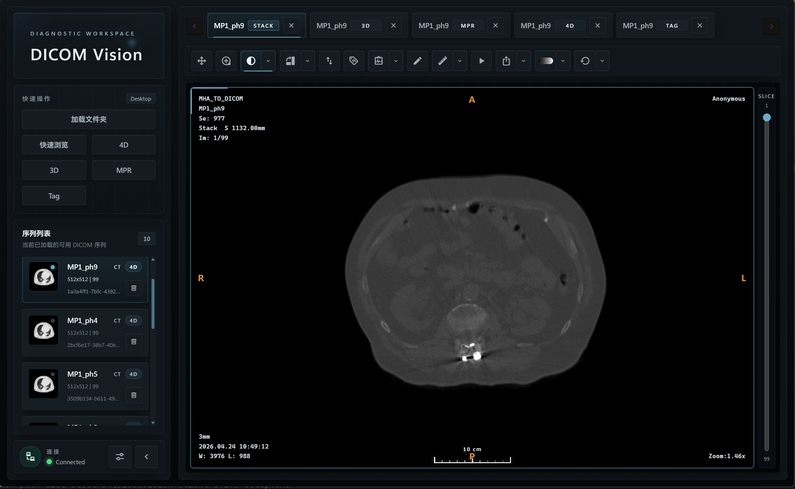
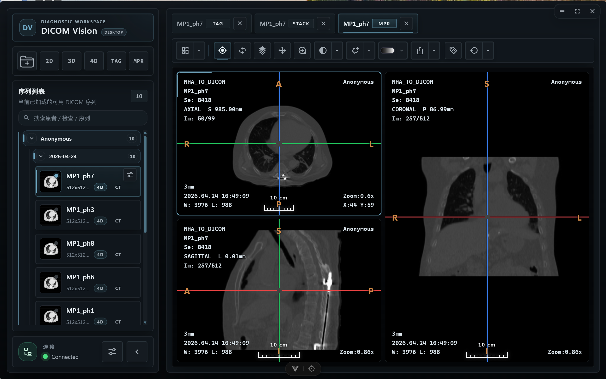
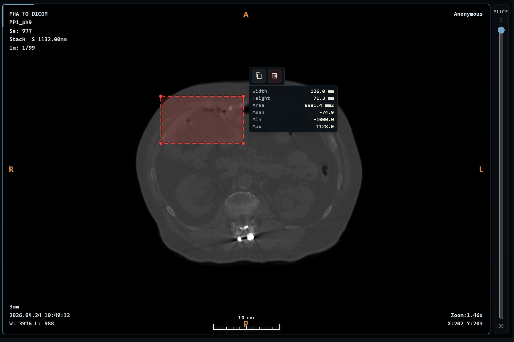
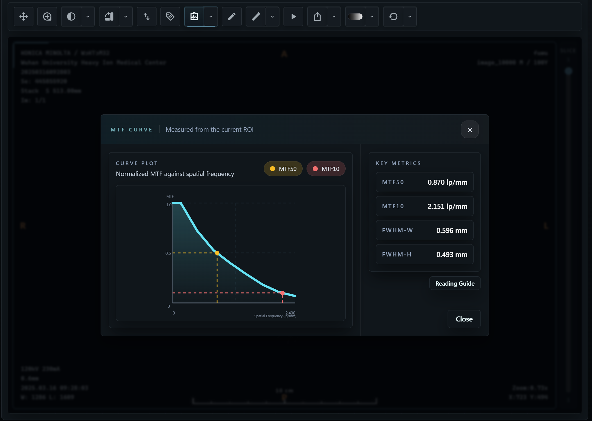
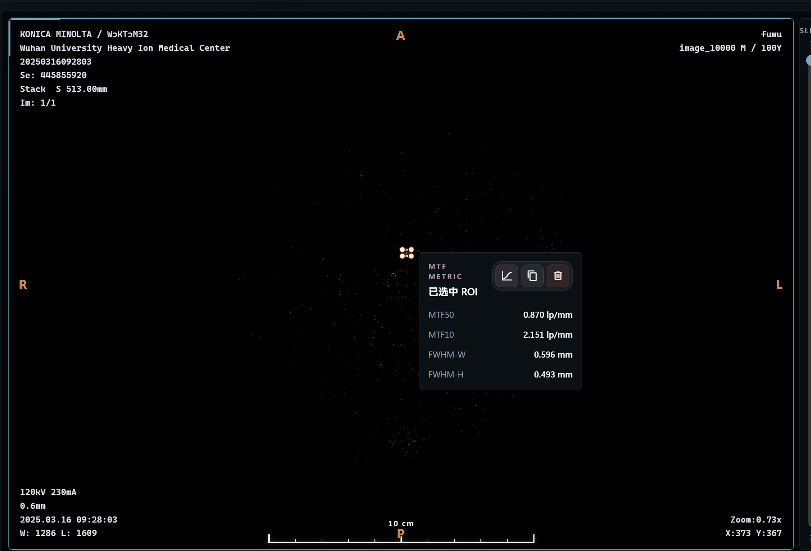

# DicomVision

[中文说明](./README.zh-CN.md)

DicomVision is a client/server DICOM viewing and analysis tool for image browsing, reconstruction, measurement, QA, metadata review, and privacy-safe export workflows. It supports Stack viewing, MPR and oblique MPR, 4D phase playback, server-side 3D volume rendering, DICOM tag inspection/editing, DICOM de-identification export, ROI measurement, MTF/FWHM analysis, water phantom QA, image export, dark/light themes, and separate web or Windows desktop deployment.

## Version 1.1.0 Updates

- Added DICOM Tag tree mode with sequence/item hierarchy, clearer indentation, and theme-aware row hover feedback.
- Added DICOM Tag editing from the tag context menu. Current-instance edits return a single DICOM copy, while series-wide edits run in the background with live progress.
- Added de-identified DICOM export from the series context menu, using configurable privacy fields and the same background progress flow as batch tag edits.
- Added drag-and-drop loading for local DICOM files or folders in the desktop app.
- Refined the compact top toolbar, tab overflow behavior, settings layout, context menus, and theme-aware toast notifications.

## Feature Overview

- **Image loading and series management**: load local DICOM folders, drag files/folders into the desktop app, use server-side sample data, or enter backend-accessible paths, then browse discovered series from the sidebar.
- **Stack viewing**: slice scrolling, window/level, zoom, pan, rotate, flip, reset, pseudocolor presets, and corner metadata overlays.
- **MPR and oblique MPR**: axial, coronal, and sagittal synchronized viewports with crosshair navigation, oblique rotation, MIP configuration, orientation overlays, and scale bars.
- **4D phase playback**: phase previews, phase switching, playback controls, FPS control, and cached multi-viewport phase images.
- **3D volume rendering**: VTK-backed backend rendering with presets, transfer functions, opacity, color, lighting, interpolation, and layer controls.
- **Measurement and analysis**: line, rectangle, ellipse, angle, curve, and freeform measurements, plus MTF/FWHM and water phantom QA workflows.
- **DICOM tag tools**: instance-level tag, VR, name, and value browsing in flat or tree mode, plus editable tag export for current DICOM or full series.
- **De-identification export**: configurable privacy-field removal for DICOM series, saved as new copies without overwriting source files.
- **Web and desktop delivery**: deploy the web client as a static app connected to a remote backend, or package a Windows Electron desktop app with an embedded backend bundle.

## Web Preview
https://dicom-vision-client.vercel.app/


## Repositories

- Client: [https://github.com/l5769389/DicomVisionClient](https://github.com/l5769389/DicomVisionClient)
- Server: [https://github.com/l5769389/DicomVisionServer](https://github.com/l5769389/DicomVisionServer)

## Screenshots

| Stack viewing | MPR reconstruction |
| --- | --- |
|  |  |

| Oblique MPR / crosshair rotation | 4D phase playback |
| --- | --- |
|  |  |

| Measurement tools | DICOM tags |
| --- | --- |
|  |  |

| MTF analysis | FWHM result |
| --- | --- |
|  |  |

| Water phantom QA | Settings |
| --- | --- |
|  |  |

| Dark theme | Light theme |
| --- | --- |
|  |  |

## Architecture

DicomVision is split into two repositories:

- `DicomVisionClient`: Electron + Vue frontend for workspace orchestration, UI state, user interaction, web builds, and desktop packaging.
- `DicomVisionServer`: FastAPI + Socket.IO backend for DICOM discovery, metadata services, 2D rendering, MPR/4D/3D computation, measurement analysis, and realtime image delivery.

Typical runtime flow:

1. The client loads a local folder, backend-accessible path, or server-side sample dataset.
2. The server discovers readable DICOM series and returns series metadata.
3. The client creates Stack, MPR, 3D, 4D, or DICOM Tag tabs.
4. Viewports are bound to Socket.IO sessions.
5. User operations are sent to the backend.
6. The backend streams rendered frames, overlays, hover data, acknowledgements, and errors back to the client.

## Tech Stack

- Vue 3
- TypeScript
- Electron
- electron-vite
- Vite web build
- Vuetify
- Tailwind CSS
- Axios
- Socket.IO Client
- Vitest
- electron-builder

## Repository Structure

```text
src/
  main/                    Electron main process and embedded backend startup
  preload/                 Electron preload bridge
  renderer/                Vue renderer application
  shared/                  shared runtime config, constants, and generated API types

src/renderer/src/
  components/              sidebar, workspace, viewport, overlay, and settings UI
  composables/             viewer workspace state and interaction orchestration
  constants/               frontend constants
  platform/                desktop/web runtime adapters
  services/                HTTP and Socket.IO clients
  types/                   viewer domain types

screenshots/               README and release screenshots
scripts/                   installer assets, server staging, and Windows release scripts
```

## Quick Start

### 1. Start the server

```bash
cd ../DicomVisionServer
uv sync
uv run python run.py
```

Default server endpoints:

- HTTP: `http://127.0.0.1:8000`
- OpenAPI: `http://127.0.0.1:8000/docs`
- Socket.IO: `http://127.0.0.1:8000/socket.io`

### 2. Start the desktop client

```bash
cd ../DicomVisionClient
npm install
npm run dev
```

Desktop development mode expects the backend to already be running at `http://127.0.0.1:8000`. To point the Electron shell at another backend, set:

```powershell
$env:DICOM_VISION_SERVER_ORIGIN = "http://127.0.0.1:8000"
npm run dev
```

## Web Development and Deployment

Run the web client locally:

```bash
npm run dev:web
```

Build the static web app:

```bash
npm run build:web
```

Preview the web build:

```bash
npm run preview:web
```

Production web variables:

```env
VITE_BACKEND_ORIGIN=https://your-backend.example.com
VITE_WEB_USE_SERVER_SAMPLE=true
```

Deployment notes:

- Deploy `DicomVisionServer` as an HTTP + Socket.IO backend. The server repository includes Render-oriented configuration.
- Deploy the client web build output from `dist-web/` to Vercel, static hosting, or any SPA-compatible host.
- Add the web frontend origin to the backend `CORS_ORIGINS`.
- When `VITE_WEB_USE_SERVER_SAMPLE=true`, the web client uses the backend sample loading endpoint instead of asking for a local filesystem path.

## Desktop Packaging

The desktop product is an Electron app that can bundle the server artifact and launch it automatically at runtime.

One-command Windows release, assuming `DicomVisionServer` is next to this repository:

```powershell
npm run release:win
```

Manual packaging with an existing server bundle:

```powershell
powershell -ExecutionPolicy Bypass -File .\scripts\package-win.ps1 -ServerBundlePath "D:\path\to\DicomVisionServer"
```

Expected server bundle shape:

```text
DicomVisionServer/
  DicomVisionServer.exe
  ...
```

The packaged installer is generated under `dist-electron/`. At runtime, the Electron main process starts the embedded backend from `resources/server/DicomVisionServer.exe`, allocates a local port, and connects the UI to that resolved backend origin.

## Scripts

- `npm run dev`: start the Electron desktop development runtime.
- `npm run dev:web`: start the browser-based Vite development server.
- `npm run build`: build the Electron main, preload, and renderer outputs.
- `npm run build:web`: build the standalone web frontend into `dist-web/`.
- `npm run preview`: preview the Electron build.
- `npm run preview:web`: preview the web build.
- `npm run generate:api-types`: regenerate frontend API types from the server OpenAPI schema.
- `npm run typecheck`: run TypeScript checks for web and Electron projects.
- `npm run test:run`: run Vitest once.
- `npm run release:win`: build the server desktop bundle and package the Windows installer.

## Backend README

Backend API, Socket.IO events, Render deployment, and desktop bundle details are documented here:

[DicomVisionServer README](https://github.com/l5769389/DicomVisionServer)
