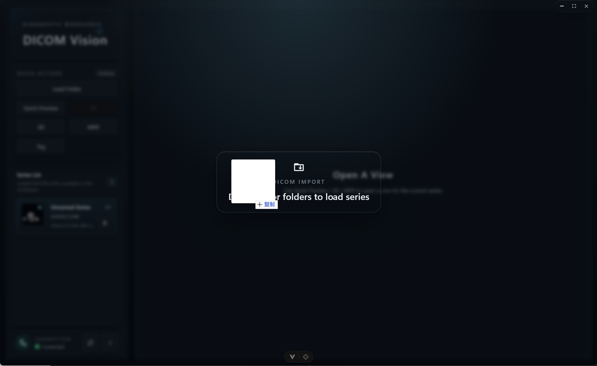

# DicomVision

[English](./README.md)

DicomVision 是一套面向 DICOM 影像浏览、重建、测量、质量分析、元数据检查与脱敏导出的 C/S 阅片工具，支持 Stack 切片阅览、MPR/斜切 MPR、4D 时相播放、服务端 3D 体渲染、DICOM 标签检查与修改、DICOM 脱敏导出、ROI 测量、MTF/FWHM 分析、水模 QA、图像导出、深浅主题切换，并可分别部署为浏览器 Web 应用或包含内置后端的 Windows 桌面应用。

## v1.1.0 更新内容

- 新增 DICOM Tag 树形显示模式，支持序列与 Item 层级、缩进关系和适配主题的行悬停高亮。
- 新增 DICOM Tag 右键修改功能，支持仅当前 DICOM 或当前 series 全部 DICOM，批量修改会在后台执行并实时显示进度。
- 新增 DICOM series 脱敏导出，脱敏字段可在设置中配置，导出流程同样支持后台任务、实时进度和完成提示。
- 新增桌面端拖拽 DICOM 文件或文件夹到应用中自动解析序列。
- 优化顶部 tab、操作栏、设置页、右键菜单、toast 提示和多主题下的视觉一致性。

## 功能总览

- **影像加载与序列管理**：加载本地 DICOM 文件夹、拖拽桌面端文件/文件夹、服务端示例数据或服务端可访问路径，自动发现序列并在侧边栏中管理。
- **Stack 阅片**：支持逐层浏览、窗宽窗位、缩放、平移、滚动、旋转、翻转、重置、伪彩和角标信息显示。
- **MPR 与斜切 MPR**：支持轴位、冠状位、矢状位三视口联动，十字线同步，斜切旋转，MIP 配置，方向标和比例尺叠加。
- **4D 时相播放**：支持多时相预览、时相切换、播放控制、FPS 调整和多视口时相缓存。
- **3D 体渲染**：后端基于 VTK 执行体渲染，支持预设、传输函数、不透明度、颜色、光照、插值和图层配置。
- **测量与分析**：支持线段、矩形、椭圆、角度、曲线、自由形状测量，并提供 MTF/FWHM 与水模 QA 分析流程。
- **DICOM 标签工具**：按实例以平铺或树形方式查看 tag、VR、名称和值，并支持将 Tag 修改导出为当前 DICOM 或整个 series 的新副本。
- **DICOM 脱敏导出**：按设置中的脱敏项清除隐私字段，为 series 生成新的脱敏 DICOM 副本，不覆盖原始文件。
- **Web 与桌面双形态**：Web 端可部署为静态前端连接远程后端；桌面端可打包 Electron 应用并内置服务端 bundle。

## Web端演示
https://dicom-vision-client.vercel.app/

## 仓库地址

- 客户端 Client：[https://github.com/l5769389/DicomVisionClient](https://github.com/l5769389/DicomVisionClient)
- 服务端 Server：[https://github.com/l5769389/DicomVisionServer](https://github.com/l5769389/DicomVisionServer)

## 项目截图

| Stack 阅片 | MPR 重建 |
| --- | --- |
|  |  |

| 斜切 MPR / 十字线旋转 | 4D 时相播放 |
| --- | --- |
|  |  |

| 测量工具 | DICOM 标签 |
| --- | --- |
|  |  |

| MTF 分析 | FWHM 结果 |
| --- | --- |
|  |  |

| 水模 QA | 设置面板 |
| --- | --- |
|  |  |

| 深色主题 | 浅色主题 |
| --- | --- |
|  |  |

| 拖拽导入 | 脱敏导出 |
| --- | --- |
|  |  |

## 系统架构

DicomVision 拆分为两个仓库：

- `DicomVisionClient`：Electron + Vue 前端，负责工作区编排、UI 状态、用户交互、Web 构建和桌面端打包。
- `DicomVisionServer`：FastAPI + Socket.IO 后端，负责 DICOM 发现、元数据服务、2D 渲染、MPR/4D/3D 计算、测量分析和实时图像推送。

典型运行流程：

1. 客户端加载本地文件夹、服务端可访问路径或服务端示例数据。
2. 服务端发现可读 DICOM 序列并返回序列元数据。
3. 客户端创建 Stack、MPR、3D、4D 或 DICOM Tag 标签页。
4. 视口通过 Socket.IO 与服务端会话绑定。
5. 用户操作持续发送到服务端。
6. 服务端实时回推渲染帧、叠加层、悬停信息、确认事件和错误信息。

## 技术栈

- Vue 3
- TypeScript
- Electron
- electron-vite
- Vite Web 构建
- Vuetify
- Tailwind CSS
- Axios
- Socket.IO Client
- Vitest
- electron-builder

## 目录结构

```text
src/
  main/                    Electron 主进程与内置后端启动逻辑
  preload/                 Electron 预加载桥接层
  renderer/                Vue 渲染层应用
  shared/                  共享运行时配置、常量和生成的 API 类型

src/renderer/src/
  components/              侧边栏、工作区、视口、叠加层和设置 UI
  composables/             阅片工作区状态和交互编排
  constants/               前端常量
  platform/                桌面端 / Web 端运行时适配
  services/                HTTP 与 Socket.IO 客户端
  types/                   阅片领域类型

screenshots/               README 与发布截图
scripts/                   安装器素材、服务端暂存和 Windows 发布脚本
```

## 快速开始

### 1. 启动服务端

```bash
cd ../DicomVisionServer
uv sync
uv run python run.py
```

服务端默认地址：

- HTTP：`http://127.0.0.1:8000`
- OpenAPI：`http://127.0.0.1:8000/docs`
- Socket.IO：`http://127.0.0.1:8000/socket.io`

### 2. 启动桌面客户端

```bash
cd ../DicomVisionClient
npm install
npm run dev
```

桌面开发模式默认要求后端已运行在 `http://127.0.0.1:8000`。如果需要连接其它后端地址，可以设置：

```powershell
$env:DICOM_VISION_SERVER_ORIGIN = "http://127.0.0.1:8000"
npm run dev
```

## Web 端开发与部署

本地启动 Web 客户端：

```bash
npm run dev:web
```

构建静态 Web 产物：

```bash
npm run build:web
```

预览 Web 构建结果：

```bash
npm run preview:web
```

生产环境常用变量：

```env
VITE_BACKEND_ORIGIN=https://your-backend.example.com
VITE_WEB_USE_SERVER_SAMPLE=true
```

部署说明：

- 将 `DicomVisionServer` 部署为 HTTP + Socket.IO 后端；服务端仓库内已有面向 Render 的配置。
- 将客户端 `dist-web/` 目录部署到 Vercel、静态托管或其它支持 SPA 的平台。
- 将 Web 前端域名加入服务端 `CORS_ORIGINS`。
- 当 `VITE_WEB_USE_SERVER_SAMPLE=true` 时，Web 客户端会调用服务端示例数据接口，而不是提示输入本地文件系统路径。

## 桌面端打包

桌面端是 Electron 应用，可以将服务端产物一起打入安装包，并在运行时自动拉起本地后端。

如果 `DicomVisionServer` 与当前仓库位于同级目录，可一键生成 Windows 安装包：

```powershell
npm run release:win
```

如果已经有服务端 bundle，也可以手动打包：

```powershell
powershell -ExecutionPolicy Bypass -File .\scripts\package-win.ps1 -ServerBundlePath "D:\path\to\DicomVisionServer"
```

服务端 bundle 目录需要满足：

```text
DicomVisionServer/
  DicomVisionServer.exe
  ...
```

生成的安装包位于 `dist-electron/`。运行时 Electron 主进程会从 `resources/server/DicomVisionServer.exe` 启动内置服务端，分配本地端口，并让 UI 自动连接到解析后的后端地址。

## 常用脚本

- `npm run dev`：启动 Electron 桌面开发环境。
- `npm run dev:web`：启动浏览器端 Vite 开发服务。
- `npm run build`：构建 Electron main、preload 和 renderer 产物。
- `npm run build:web`：构建独立 Web 前端到 `dist-web/`。
- `npm run preview`：预览 Electron 构建结果。
- `npm run preview:web`：预览 Web 构建结果。
- `npm run generate:api-types`：从服务端 OpenAPI schema 重新生成前端 API 类型。
- `npm run typecheck`：运行 Web 与 Electron 项目的 TypeScript 检查。
- `npm run test:run`：运行一次 Vitest。
- `npm run release:win`：构建服务端桌面 bundle 并生成 Windows 安装包。

## 后端 README

后端 API、Socket.IO 事件、Render 部署和桌面 bundle 说明见：

[DicomVisionServer README](https://github.com/l5769389/DicomVisionServer)
