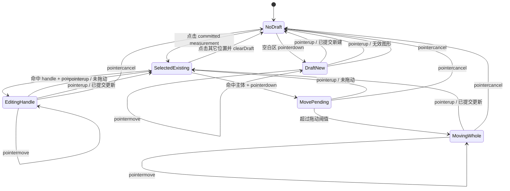
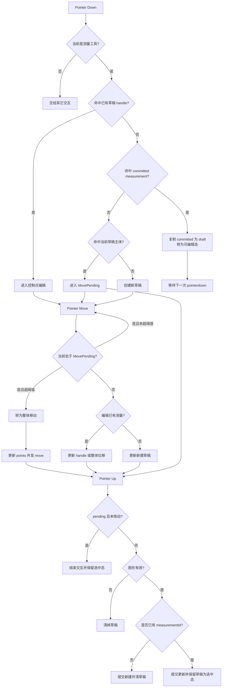

# 测量状态流转说明

这份文档按当前前端实现梳理测量工具的状态变化，重点回答 3 个问题：

- 当前有哪些“测量状态”
- 每个状态由什么事件进入、退出
- 新建、选中、移动、改点、提交、取消时，界面和数据分别如何变化

文档基于以下实现文件：

- `src/renderer/src/composables/useViewerWorkspacePointer.ts`
- `src/renderer/src/components/ViewerWorkspace.vue`
- `src/renderer/src/composables/useViewerWorkspace.ts`
- `src/renderer/src/components/viewer/ViewportMeasurementOverlay.vue`

## 1. 总体模型

当前测量交互由两层数据共同决定：

- 已完成测量
  - 来自后端回传，存放在 `activeTab.measurements` 或 `activeTab.viewportMeasurements`
  - 类型是 `MeasurementOverlay`
- 当前草稿测量
  - 仅存在前端，存放在 `draftMeasurements[viewportKey]`
  - 类型是 `MeasurementDraft`

界面总是把“草稿层”画在“已完成层”之上。

如果某个草稿带有 `measurementId`，说明它不是新建图形，而是在编辑一个已经存在的测量。此时：

- 视图层会把同 `measurementId` 的已完成图形隐藏
- 当前显示的就是草稿版本
- 即使后端已经回传了最新结果，当前实现也仍然保持该草稿为选中/可编辑态

## 2. 关键字段

`MeasurementDraft` 当前最关键的字段有：

- `measurementId`
  - 不存在：表示“新建中的测量”
  - 存在：表示“正在编辑已有测量”
- `selectedHandleIndex`
  - `null`：整体选中，但没有抓住某个控制点
  - `0/1/2/3` 等：正在编辑某个控制点
  - `-1`：正在整体移动
- `isMoving`
  - `true`：当前是整体平移中的高亮表现
  - `false`：当前不是整体平移
- `isCommitted`
  - `false`：前端本地编辑中，尚未完成一次提交后的稳定展示
  - `true`：该草稿已经提交过一次，当前被保留为“选中态”

补充说明：

- `measurementDragMoved` 不是响应式状态，它是指针交互期间的临时标记，用于区分“只是点击一下”还是“真的拖动了”
- `isMeasurementDrawing` 这个命名偏宽泛，实际上同时承载了“新建中”和“编辑中”
- `isMeasurementMovePending` 表示已经点中了图形主体，但还没超过拖动阈值，尚未正式进入整体移动

## 3. 界面上的可见状态

虽然代码里没有单独定义枚举状态，但从渲染表现上可以拆成下面几种：

### 3.1 无草稿

- 当前 viewport 没有 `draftMeasurements[viewportKey]`
- 画面只显示后端返回的已完成测量

### 3.2 新建草稿

特征：

- `measurementId` 不存在
- `selectedHandleIndex` 通常为 `null`
- `isCommitted = false`

表现：

- 橙色虚线/草稿态
- 松开鼠标后，如果图形有效，则创建为正式测量并清掉草稿

### 3.3 已选中已有测量

特征：

- `measurementId` 存在
- `selectedHandleIndex = null`
- `isMoving = false`

表现：

- 已完成测量被前端草稿替代显示
- 视觉上是选中态，不是普通 committed 态

### 3.4 正在整体移动

特征：

- `measurementId` 存在
- `selectedHandleIndex = -1`
- `isMoving = true`

表现：

- 高亮显示为 moving 态
- `pointermove` 中持续平移所有点

### 3.5 正在编辑控制点

特征：

- `measurementId` 存在
- `selectedHandleIndex >= 0`
- `isMoving = false`

表现：

- 对某个 handle 拖动
- `line / angle` 直接改对应点
- `rect / ellipse` 以对角点重建包围框

## 4. 进入编辑态的入口

`handleViewportPointerDown(event, viewportKey)` 是测量交互的总入口。

### 4.1 点击现有草稿的控制点

如果当前 viewport 已经有草稿，且命中了草稿 handle：

1. `setPointerCapture`
2. `isMeasurementDrawing = true`
3. `measurementViewportKey = viewportKey`
4. `measurementDragMoved = false`
5. 更新草稿：
   - `isCommitted = false`
   - `isMoving = false`
   - `selectedHandleIndex = handleIndex`
6. 发送一次 `measurementDraft start`

这会进入“编辑控制点”状态。

### 4.2 点击后端返回的已完成测量

如果当前没有命中草稿 handle，但命中了 committed measurement：

1. 自动把工具切到对应测量类型 `stack:measure:<toolType>`
2. 生成一个新的草稿副本
3. 该草稿带上原测量的：
   - `measurementId`
   - `toolType`
   - `points`
   - `labelLines`

这一步只是“转为可编辑态”，还没有开始拖动，因此不会立即 `setPointerCapture`。

### 4.3 点击当前草稿主体

如果当前已有草稿，且命中了草稿主体而非 handle：

1. `setPointerCapture`
2. 记录 `measurementPendingStartPoint`
3. `isMeasurementMovePending = true`
4. `measurementDragMoved = false`

这时进入“待确认移动”状态。只有移动距离超过阈值后，才会真正进入整体移动。

### 4.4 空白区域新建测量

如果以上都没命中，则进入新建流程：

1. `setPointerCapture`
2. `isMeasurementDrawing = true`
3. `measurementViewportKey = viewportKey`
4. 创建初始草稿 `[point, point]`
5. 发送 `measurementDraft start`

对 `angle` 工具有一个特殊逻辑：

- 第一次拖出前两点
- 第二次点击/拖动补第三点

## 5. Pointer Move 阶段

### 5.1 待确认移动 -> 正式整体移动

当 `isMeasurementMovePending = true` 时：

1. 计算当前点与按下点的像素位移
2. 如果位移小于 `DRAG_START_THRESHOLD`，继续等待
3. 如果超过阈值：
   - `isMeasurementMovePending = false`
   - `isMeasurementDrawing = true`
   - `measurementDragLastPoint = measurementPendingStartPoint`
   - 更新草稿为：
     - `isCommitted = false`
     - `isMoving = true`
     - `selectedHandleIndex = -1`

此时正式进入“整体移动”。

### 5.2 整体移动中的 move

当草稿满足：

- `measurementId` 存在
- `selectedHandleIndex === -1`

则每次移动都会：

1. 计算相对上一个点的位移
2. 调用 `translateMeasurementPoints(...)`
3. 对所有点做平移，并限制在 `[0, 1]` 图像范围内
4. 设置：
   - `isMoving = true`
   - `isCommitted = false`
5. 发送节流后的 `measurementDraft move`

### 5.3 控制点编辑中的 move

当草稿满足：

- `measurementId` 存在
- `selectedHandleIndex >= 0`

则每次移动都会：

1. 根据工具类型更新点位
2. `measurementDragMoved = true`
3. 设置：
   - `isMoving = false`
   - `isCommitted = false`
4. 发送节流后的 `measurementDraft move`

### 5.4 新建中的 move

当草稿没有 `measurementId` 时：

- `line / rect / ellipse`：实时用起点和当前点更新图形
- `angle`：按两段式逻辑更新第二点或第三点

同样会发送节流后的 `measurementDraft move`。

## 6. Pointer Up 阶段

`handleViewportPointerUp(event)` 是状态收束点。

### 6.1 待确认移动但没有真正拖动

如果还停留在 `isMeasurementMovePending = true`：

- 直接取消 pending
- 不改草稿
- 结束交互

也就是说，单击一个已选中的图形主体，不会触发位移。

### 6.2 编辑已有测量，但没有发生实际拖动

条件：

- `draft.measurementId` 存在
- `draft.selectedHandleIndex != null`
- `measurementDragMoved = false`

当前实现会把草稿收敛成：

- `isCommitted = false`
- `isMoving = false`
- `selectedHandleIndex = null`

含义是：

- 退出“正在改点/正在移动”的子状态
- 保留为“已选中已有测量”
- 不会退出编辑态

### 6.3 新建或编辑后完成一次有效提交

如果图形有效：

1. 先 `emitThrottledMeasurementDraft.flush()`
2. 再调用 `emitMeasurementCreate(...)`

这一步在语义上既用于：

- 新建一个测量
- 也用于更新一个已有测量

区分方式就是是否带 `measurementId`。

提交后的前端行为：

- 新建测量
  - 没有 `measurementId`
  - 直接 `clearDraftMeasurement(viewportKey)`
  - 界面等待后端回传 committed measurement
- 编辑已有测量
  - 有 `measurementId`
  - 不再清草稿
  - 更新为：
    - `isCommitted = true`
    - `isMoving = false`
    - `selectedHandleIndex = null`
  - 因此会继续保持“选中且可再次编辑”的状态

### 6.4 图形无效

如果图形不满足最小有效条件：

- 直接清掉草稿

例如：

- 线段两点重合
- 矩形/椭圆两个角点重合
- 角度工具不足 3 点，或两条边退化

## 7. Cancel 阶段

`handleViewportPointerCancel(event)` 的处理比 `pointerup` 更强硬。

如果发生 cancel：

- pending move 被清空
- 当前 viewport 的草稿直接被清掉
- 交互结束

所以 cancel 更像“放弃本轮本地编辑”。

## 8. 前后端通信语义

前端对测量的 socket/操作层统一走 `emitMeasurementOperation(...)`：

- `opType = measurement`
- `subOpType = line | rect | ellipse | angle`
- `actionType = start | move | end`
- `viewportKey`
- `points`
- `measurementId?`

其中：

- `measurementDraft start/move/end` 用于拖动过程中的预览和后端量测计算
- `measurementCreate` 最终也会被转成一次 `phase = end` 的 measurement 操作

当前前端把 `labelLines` 的所有权放在本地草稿层：

- 后端返回 `MeasurementDraftPayload`
- `ViewerWorkspace.vue` 中的 `handleMeasurementDraftUpdate(...)` 会把 `labelLines` 写回本地草稿

## 9. 当前状态机

### 9.1 状态图

### 9.2 顺序流程图

## 10. 视觉状态与数据状态的对应关系

`ViewportMeasurementOverlay.vue` 最终会把草稿映射为以下渲染模式：

- `committed`
  - 普通已完成态
- `selected`
  - 已选中已有测量
- `moving`
  - 整体平移中
- `draft`
  - 新建中或正在改点

映射规则核心是：

- 有 `measurementId` 且 `selectedHandleIndex === -1 && isMoving === true`
  - 渲染为 `moving`
- 有 `measurementId` 且 `selectedHandleIndex == null || selectedHandleIndex === -1`
  - 渲染为 `selected`
- 其它草稿
  - 渲染为 `draft`

所以：

- “已选中已有测量”与“新建草稿”虽然都属于前端草稿层
- 但视觉样式不同

## 11. 当前实现的关键结论

可以把当前测量系统理解成下面这句话：

> 已完成测量并不会直接原地编辑，而是先复制成一个前端草稿；用户所有拖动都发生在草稿上；提交后，新建草稿会消失，已有测量的草稿会保留为选中态。

这也是最近改动后的核心行为变化：

- 以前：编辑/移动已有测量后，提交会立刻退出编辑态
- 现在：编辑/移动已有测量后，提交仍保持选中态，便于继续调整

## 12. 代码定位建议

如果你后续要继续改测量交互，建议优先看这几个函数：

- `useViewerWorkspacePointer.ts`
  - `handleViewportPointerDown`
  - `handleViewportPointerMove`
  - `handleViewportPointerUp`
  - `handleViewportPointerCancel`
  - `findCommittedMeasurementAtPoint`
  - `isMeasurementHit`
  - `updateEditedMeasurementPoints`
  - `translateMeasurementPoints`
- `ViewerWorkspace.vue`
  - `getDraftMeasurement`
  - `getVisibleCommittedMeasurements`
  - `handleMeasurementDraftUpdate`
- `useViewerWorkspace.ts`
  - `emitMeasurementOperation`
  - `handleMeasurementCreate`
  - `handleMeasurementDraft`

