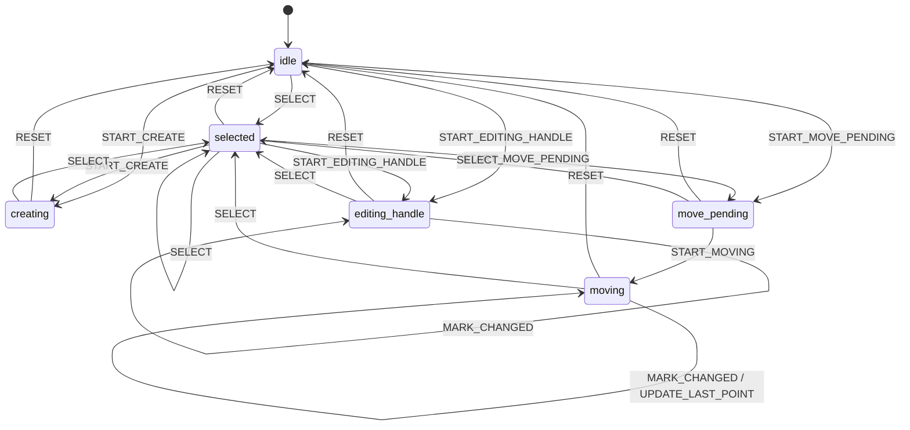
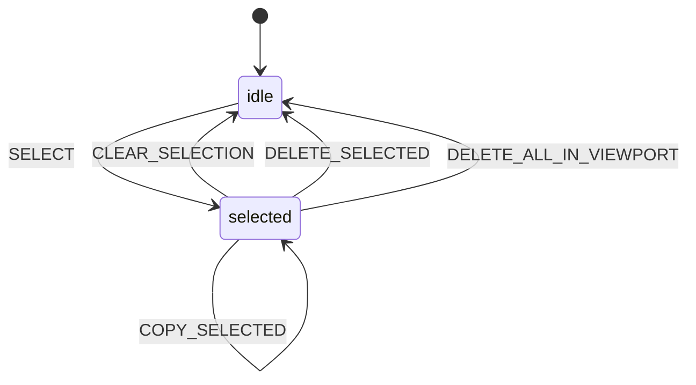

# 测量交互与状态机说明

本文档整理当前项目中测量功能的实现方式、状态流转，以及下一阶段准备加入的复制/删除交互方案。

当前文档基于以下代码：

- `src/renderer/src/composables/measurements/useViewerWorkspacePointer.ts`
- `src/renderer/src/composables/measurements/measurementInteractionMachine.ts`
- `src/renderer/src/composables/measurements/measurementGeometry.ts`
- `src/renderer/src/components/workspace/ViewerWorkspace.vue`
- `src/renderer/src/components/viewer/views/ViewerCanvasStage.vue`
- `src/renderer/src/components/viewer/overlays/ViewportMeasurementOverlay.vue`
- `src/renderer/src/composables/workspace/core/useViewerWorkspace.ts`

## 1. 总体设计

当前测量系统已经拆成 4 层：

1. 数据层
- 已提交测量来自后端，存放在 `activeTab.measurements` 或 `activeTab.viewportMeasurements`
- 当前前端编辑副本存放在 `draftMeasurements[viewportKey]`

2. 状态机层
- `measurementInteractionMachine.ts` 负责“当前用户正在做什么”
- 它不保存几何点位，只保存交互状态和少量上下文

3. 几何层
- `measurementGeometry.ts` 负责命中测试、控制点判断、平移、改点、合法性判断
- 这一层尽量保持纯函数

4. 视图层
- `ViewportMeasurementOverlay.vue` 只根据传入的测量数据和 `draftMeasurementMode` 渲染
- UI 不再自己猜测 `selectedHandleIndex === -1` 这类旧语义

## 2. 当前已完成的核心改造

以下内容已经完成：

- 已完成测量转为可编辑时，不会直接原地修改 committed measurement，而是复制成前端 draft
- draft 数据与交互状态已解耦
- `MeasurementDraft` 不再承载 `isCommitted`、`isMoving`、`selectedHandleIndex`
- 测量交互已经迁移到显式状态机
- pointer 逻辑已拆成路由层和专项 handler
- 命中决策已抽为纯函数
- UI 渲染模式已显式化为 `draft` / `selected` / `moving`

这意味着当前测量系统已经从“多个布尔值拼装状态”升级成“状态机 + 纯几何函数 + UI 显式模式”。

## 3. 当前数据模型

### 3.1 committed measurement

后端返回的测量对象，类型为 `MeasurementOverlay`。

用途：

- 持久化测量结果
- 作为正常显示层
- 被选中时可复制为前端 draft

### 3.2 draft measurement

前端本地工作副本，类型为 `MeasurementDraft`。

用途：

- 新建中的测量
- 已有测量的编辑副本
- 当前选中的可继续编辑副本

当前 `MeasurementDraft` 只表示数据本身：

- `toolType`
- `points`
- `measurementId?`
- `labelLines?`

它不再表示交互态。

### 3.3 draft 渲染模式

视图层目前使用 `DraftMeasurementMode`：

- `draft`
- `selected`
- `moving`

其来源是：

- `measurementInteractionMachine.ts` 中的 `resolveDraftMeasurementMode(...)`

## 4. 当前状态机

### 4.1 状态定义

当前测量状态机包含以下状态：

- `idle`
- `selected`
- `creating`
- `move_pending`
- `moving`
- `editing_handle`

这些状态的含义如下：

#### `idle`

当前没有处于测量交互中。

#### `selected`

当前已有一个测量被选中，但还没有开始拖动或改控制点。

上下文：

- `viewportKey`
- `measurementId`

#### `creating`

当前正在新建一个测量。

上下文：

- `viewportKey`
- `toolType`

#### `move_pending`

已经按下了一个选中的测量主体，但还没超过拖拽阈值。

这是一个很重要的过渡态，用于区分：

- 单击选中
- 真正开始拖动

上下文：

- `viewportKey`
- `measurementId`
- `startPoint`

#### `moving`

当前正在整体移动一个已有测量。

上下文：

- `viewportKey`
- `measurementId`
- `lastPoint`
- `hasChanged`

#### `editing_handle`

当前正在编辑一个已有测量的控制点。

上下文：

- `viewportKey`
- `measurementId`
- `handleIndex`
- `hasChanged`

### 4.2 当前状态图

## 5. 当前 pointer 交互流程

`useViewerWorkspacePointer.ts` 现在已经是“路由器 + 专项处理器”的结构。

### 5.1 Pointer Down

`handleViewportPointerDown(...)` 只负责分发到三类交互：

- `handleMeasurementPointerDown`
- `handleCrosshairPointerDown`
- `handleViewportDragPointerDown`

其中测量部分会先通过：

- `resolveMeasurementPointerDownIntent(...)`

把命中结果解释成意图：

- `edit_handle`
- `select_committed`
- `move_draft`
- `clear_draft`
- `create_new`

### 5.2 Pointer Move

`handleViewportPointerMove(...)` 也只做分发：

- 测量移动
- crosshair 拖动
- viewport drag

其中测量移动逻辑已经拆到：

- `handleMeasurementPointerMove(...)`
- `handleActiveMeasurementEditMove(...)`

### 5.3 Pointer Up

`handleViewportPointerUp(...)` 负责收束：

- `move_pending` 未越阈值时，回到 `selected`
- `moving` / `editing_handle` / `creating` 时，提交或清理 draft
- 统一结束 pointer capture

### 5.4 Pointer Cancel

`handleViewportPointerCancel(...)` 更偏向放弃本轮本地交互：

- 新建中的草稿会被清掉
- 正在拖动或改点也会终止

## 6. 当前可见行为

### 6.1 新建测量

- 空白处按下后创建 draft
- 拖动过程中持续发送 `measurementDraft`
- 抬起后如果图形有效，则发送 `measurementCreate`
- 新建成功后当前 draft 清掉，等待 committed measurement 回显

### 6.2 选择已有测量

- 点击 committed measurement 后，不直接改 committed
- 会复制成带 `measurementId` 的 draft
- 当前 committed 同 `measurementId` 的图形会被隐藏
- 用户看到的是当前可继续编辑的 draft

### 6.3 编辑已有测量

- 点击 handle 进入 `editing_handle`
- 点击主体进入 `move_pending`
- 超过阈值后进入 `moving`
- 提交后仍保留为 `selected`

### 6.4 提交后保持选中

这是当前已经完成的关键行为：

- 以前：编辑或移动已有测量后，提交会立刻退回普通 committed 态
- 现在：编辑或移动已有测量后，提交会继续保持为选中可编辑态

## 7. 当前渲染规则

`resolveDraftMeasurementMode(...)` 当前规则如下：

- `moving` 且该 viewport 正在编辑已有测量：渲染为 `moving`
- `selected` 或 `move_pending` 且该 viewport 正在编辑已有测量：渲染为 `selected`
- 其它情况：渲染为 `draft`

这意味着：

- 新建中是 `draft`
- 改控制点时也是 `draft`
- 选中已有测量但未拖动时是 `selected`
- 整体移动中是 `moving`

## 8. 当前状态机设计评价

当前这套状态规划是合理的，原因有三点：

- 状态是互斥的，语义明确
- `move_pending` 这种关键过渡态被显式建模了
- 状态机和几何数据已经拆开，没有再靠多个布尔值拼装

当前仍然保留在 pointer 层的复杂度主要是：

- pointer 事件与副作用耦合
- 测量复制、删除等对象级操作还没接入状态机

## 9. 下一阶段需求：复制、删除、删除全部

这是下一步准备完成的交互方案，目前尚未落代码。

### 9.1 目标能力

单个已选中测量支持：

- 复制
- 删除

当前 viewport 支持：

- 删除全部测量

### 9.2 推荐 UI 方案

推荐采用“对象就地操作 + 全局补充入口”的组合。

#### 单个测量

当某个测量进入 `selected` 状态时：

- 在测量标签附近或 viewport 右上角显示轻量操作条
- 提供：
  - `复制`
  - `删除`

推荐原因：

- 发现性强
- 不需要用户回到顶部工具栏
- 更符合“对当前对象操作”的心智

#### 删除全部

不建议放在测量旁边。

建议放在：

- 顶部测量菜单
- 或 viewport 右键菜单

文案建议：

- `删除当前视图全部测量`

并建议加确认。

### 9.3 推荐快捷键

建议同时支持快捷键：

- `Delete` / `Backspace`
  - 删除当前选中测量
- `Ctrl/Cmd + C`
  - 复制当前选中测量
- `Esc`
  - 取消选中

这些快捷键作为效率入口，不作为唯一入口。

## 10. 下一阶段交互草案

### 10.1 复制

触发方式：

- 点击选中态浮动工具条中的 `复制`
- 或按 `Ctrl/Cmd + C`

建议行为：

1. 以当前选中 measurement 为源创建一个新的 draft
2. 新 draft 不复用原 `measurementId`
3. 点位整体轻微偏移，避免完全重叠
4. 新 draft 立即成为当前选中对象
5. 保持可继续拖动或编辑

推荐偏移：

- 归一化坐标下 `x + 0.01`、`y + 0.01`
- 超出边界时做 clamp

### 10.2 删除单个

触发方式：

- 点击选中态浮动工具条中的 `删除`
- 或按 `Delete`

建议行为：

1. 如果当前是 `selected`
2. 删除对应 `measurementId`
3. 清掉当前 draft
4. 状态机回到 `idle`

### 10.3 删除全部

触发方式：

- 顶部测量菜单中的 `删除当前视图全部测量`

建议行为：

1. 仅删除当前 viewport 下的全部测量
2. 若当前有 draft，一并清理
3. 状态机回到 `idle`
4. 建议弹确认

## 11. 下一阶段状态机扩展建议

当前不建议为了复制/删除强行再增加很多常驻状态。

更合理的方式是：

- 保持当前主状态机负责“交互阶段”
- 把复制、删除、删除全部视为“对 selected 对象的动作事件”

### 11.1 建议新增事件

建议在测量交互层引入以下动作事件：

- `COPY_SELECTED`
- `DELETE_SELECTED`
- `DELETE_ALL_IN_VIEWPORT`
- `CLEAR_SELECTION`

### 11.2 建议状态机扩展方式

推荐保守扩展，不新增重量级持久状态，只加动作事件：

这里的含义是：

- `COPY_SELECTED`
  - 本质是一次对象复制动作
  - 完成后仍停留在“有选中对象”的语义上
  - 只是选中的对象切换为新副本
- `DELETE_SELECTED`
  - 执行后失去选中对象，回到 `idle`
- `DELETE_ALL_IN_VIEWPORT`
  - 执行后回到 `idle`

如果后面再支持多选，再考虑引入：

- `multi_selected`

当前不要提前设计。

## 12. 推荐的实现顺序

建议按以下顺序推进：

1. 删除单个选中测量
- 复杂度最低
- 能先打通对象级操作链路

2. 复制单个选中测量
- 需要处理新 draft 偏移和重新选中

3. 删除当前 viewport 全部测量
- 需要定义前后端接口和确认交互

## 13. 代码改造建议

### 13.1 前端

主要改动点预计在：

- `src/renderer/src/components/viewer/overlays/ViewportMeasurementOverlay.vue`
  - 增加选中态操作按钮
- `src/renderer/src/components/workspace/shell/ViewerToolbar.vue`
  - 增加删除全部入口
- `src/renderer/src/composables/measurements/useViewerWorkspacePointer.ts`
  - 增加选中对象动作入口
- `src/renderer/src/composables/measurements/measurementInteractionMachine.ts`
  - 增加复制/删除相关事件
- `src/renderer/src/composables/workspace/core/useViewerWorkspace.ts`
  - 对接新的 measurement delete/copy 操作

### 13.2 后端/协议

如果复制和删除要持久化，建议补充统一测量操作语义，例如：

- `measurement_copy`
- `measurement_delete`
- `measurement_delete_all`

或者继续统一走 `measurement` 操作通道，但增加明确的 `actionType`。

## 14. 总结

当前已经完成的设计重点是：

- 测量交互已状态机化
- 几何逻辑已抽离
- draft 数据与交互态已解耦
- 已有测量编辑后会保持选中态

下一步推荐实现的是：

- 单测量删除
- 单测量复制
- 当前视图删除全部

推荐交互方案是：

- 选中后显示轻量浮动操作条
- 同时支持键盘快捷键
- 删除全部放在顶部菜单并加确认
