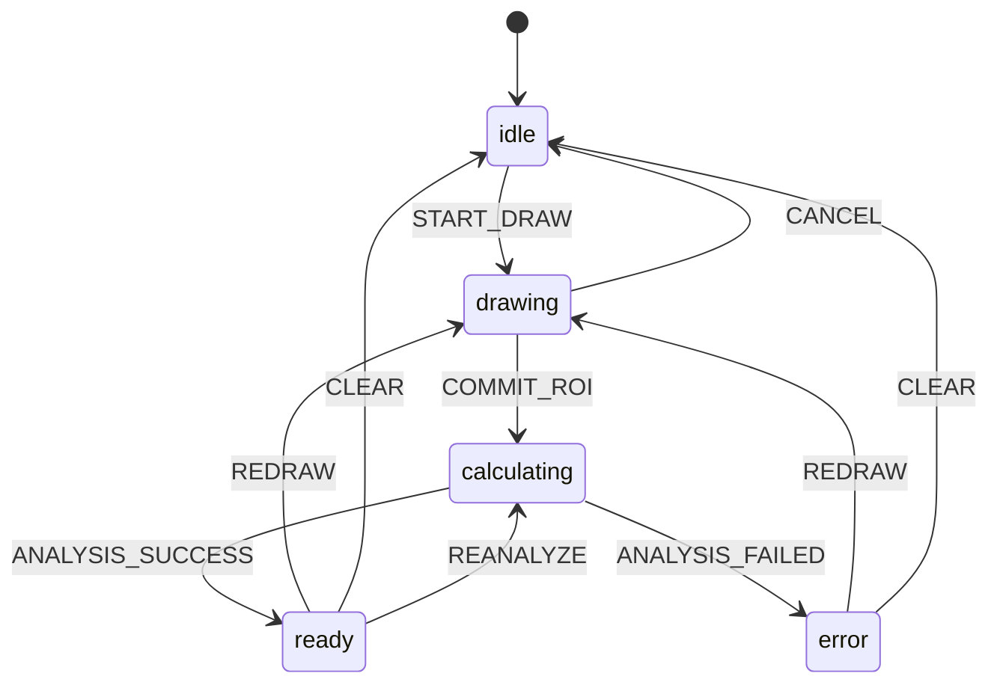

# MTF 性能评估功能需求文档

本文档定义 Viewer 中新增的 MTF 性能评估功能需求，目标是为当前影像浏览工作区增加一套独立于普通测量的矩形 ROI 分析能力，用于计算并展示 MTF 指标与曲线。

当前需求基于以下原则：

- MTF 不是普通测量工具的一个 metric 扩展，而是一个独立功能入口
- MTF 交互形态与矩形 ROI 相似，但同一时刻只允许存在一个有效 MTF ROI
- MTF 的结果展示分为两层：
  - 轻量指标信息：显示在 metric 区域
  - 详细曲线信息：通过独立弹窗展示

## 1. 目标

新增一个独立的 MTF 按钮，用户点击后进入 MTF 标注模式，在当前视口内绘制一个矩形 ROI。系统基于该 ROI 调用后端执行 MTF 分析，并在界面上展示：

- 当前 MTF ROI 的几何区域
- MTF 关键指标
- 可单独打开的 MTF 曲线弹窗

该功能主要面向性能评估场景，不应与通用测量对象混用，也不应影响现有线段、矩形、椭圆、角度测量的行为。

## 2. 范围

本期包含：

- Viewer 工具栏新增独立 MTF 按钮
- 单视口内创建、更新、替换一个 MTF 矩形 ROI
- metric 区域显示 MTF 指标
- 弹窗显示 MTF 曲线
- 前后端请求链路与数据结构定义

本期不包含：

- 多个 MTF ROI 并存
- MTF 历史结果列表
- MTF 结果持久化到普通测量列表
- 多视口联动复制 MTF ROI
- 曲线图导出、打印、报告生成

## 3. 用户故事

### 3.1 创建 MTF ROI

作为医生或工程用户，我希望点击一个独立的 MTF 按钮后，在当前图像上绘制一个矩形区域，并立即得到该区域的 MTF 分析结果。

### 3.2 替换 MTF ROI

作为用户，我希望在同一视口内重新绘制 MTF 区域时，旧的 MTF ROI 自动被替换，而不是叠加多个区域，避免界面混乱。

### 3.3 查看指标

作为用户，我希望在主界面 metric 区域直接看到关键 MTF 指标，而不是再去翻找普通测量标签。

### 3.4 查看曲线

作为用户，我希望点击“查看 MTF 曲线”后弹出单独窗口，查看完整曲线和关键点位信息。

## 4. 交互设计

### 4.1 工具入口

工具栏新增独立按钮：

- 按钮名称：`MTF`
- 按钮类型：一级操作按钮，不放在当前“测量”下拉菜单中
- 建议图标：独立的性能曲线或频响图标

按钮行为：

- 点击后进入当前激活 viewport 的 MTF 模式
- 若当前已经处于 MTF 模式，再次点击可保持激活，不要求切换关闭
- 切换到其他普通模式工具后，MTF 绘制模式结束

### 4.2 绘制行为

MTF 模式下，用户在当前 viewport 中按下并拖拽，生成一个矩形 ROI。

规则：

- 同一 viewport 仅允许存在一个 MTF ROI
- 新绘制成功后，旧的 MTF ROI 立即被替换
- ROI 的视觉形态可复用矩形测量的框选样式，但应有独立样式标识，避免与普通矩形测量混淆
- MTF ROI 不进入普通 measurement 列表

### 4.3 编辑行为

建议本期支持最小闭环：

- 创建 MTF ROI
- 重新绘制并替换
- 删除当前 MTF ROI

本期可不做：

- 拖拽移动已有 MTF ROI
- 拖拽控制点编辑已有 MTF ROI

如果后续要补编辑能力，建议沿用现有 measurement draft 状态机思路，但 MTF 使用独立状态和数据结构。

### 4.4 删除行为

用户可通过以下方式清除当前 MTF ROI：

- 在 MTF metric 区域点击“清除”
- 在 MTF 曲线弹窗中点击“清除当前 ROI”
- 重新绘制新 ROI 时自动替换旧 ROI

清除后：

- ROI 覆盖层消失
- metric 区域中的 MTF 指标清空
- 曲线弹窗若打开，应显示“暂无 MTF 数据”或自动关闭

## 5. 结果展示

### 5.1 Metric 区域

MTF 功能激活且结果返回后，metric 区域显示 MTF 专属信息，不显示普通矩形 ROI 的均值、标准差等内容。

建议展示字段：

- `MTF50`
- `MTF10`
- 峰值或归一化峰值
- 采样点数量
- 分析状态：计算中 / 成功 / 失败

展示要求：

- 当存在有效 MTF ROI 时，metric 区域优先显示 MTF 结果卡片
- 若没有 ROI，则显示空态提示，例如“绘制矩形区域开始 MTF 分析”
- 若计算失败，显示错误状态和简短失败原因

### 5.2 曲线弹窗

界面提供“查看曲线”按钮，点击后弹出独立窗口或模态框。

弹窗内容建议包含：

- 曲线图主区域
- 横轴：空间频率
- 纵轴：归一化响应
- 曲线关键点标记：MTF50、MTF10
- 结果摘要
- 当前 ROI 基本信息

弹窗交互要求：

- 当有可用结果时可打开
- 当 ROI 被替换后，弹窗内容自动刷新为最新结果
- 当 ROI 被清除后，弹窗进入空态或自动关闭

本期建议优先用应用内模态框实现，不单独打开系统级窗口。

## 6. 功能状态

建议为 MTF 引入独立状态，而不是复用普通测量状态。

推荐前端状态：

- `idle`
- `drawing`
- `calculating`
- `ready`
- `error`

状态说明：

- `idle`：无 MTF ROI，无结果
- `drawing`：用户正在绘制矩形
- `calculating`：ROI 已提交，等待后端分析结果
- `ready`：已有有效 ROI 和结果
- `error`：分析失败

状态流转建议：



## 7. 数据模型建议

### 7.1 前端 ROI 数据

建议新增独立结构：

```ts
interface MtfRoiDraft {
  viewportKey: string
  points: [Point2D, Point2D, Point2D, Point2D]
}
```

如果内部继续沿用矩形两点表达，也可定义为：

```ts
interface MtfRoiRect {
  viewportKey: string
  start: Point2D
  end: Point2D
}
```

### 7.2 前端结果数据

```ts
interface MtfMetricResult {
  mtf50: number | null
  mtf10: number | null
  peakValue: number | null
  sampleCount: number | null
  unit?: string
}

interface MtfCurvePoint {
  frequency: number
  value: number
}

interface MtfAnalysisResult {
  metrics: MtfMetricResult
  curve: MtfCurvePoint[]
  roiBounds: {
    x: number
    y: number
    width: number
    height: number
  }
}
```

## 8. 前后端职责划分

### 8.1 前端职责

- 提供 MTF 工具按钮和激活状态
- 管理单个 MTF ROI 的绘制、替换、清除
- 发起 MTF 分析请求
- 展示 metric 信息
- 展示曲线弹窗

### 8.2 后端职责

- 接收当前视口图像与 ROI 信息
- 执行 MTF 分析算法
- 返回结构化指标与曲线数据
- 返回错误码和错误信息

### 8.3 边界约束

- 前端不做 MTF 算法计算
- 后端不关心按钮状态和弹窗显示
- 普通测量与 MTF 分析在数据链路上分离

## 9. API 草案

建议新增独立接口，而不是复用普通 measurement create/update 接口。

示例：

```http
POST /api/views/{viewId}/mtf/analyze
```

请求体示例：

```json
{
  "viewportKey": "single",
  "roi": {
    "x": 120.5,
    "y": 88.0,
    "width": 64.0,
    "height": 48.0
  }
}
```

响应体示例：

```json
{
  "metrics": {
    "mtf50": 0.42,
    "mtf10": 0.77,
    "peakValue": 1.0,
    "sampleCount": 128,
    "unit": "lp/mm"
  },
  "curve": [
    { "frequency": 0.0, "value": 1.0 },
    { "frequency": 0.1, "value": 0.93 }
  ],
  "roiBounds": {
    "x": 120.5,
    "y": 88.0,
    "width": 64.0,
    "height": 48.0
  }
}
```

错误返回建议包含：

- `code`
- `message`
- 可选 `details`

## 10. 前端实现建议

### 10.1 工具栏

在 `useViewerWorkspaceToolbar.ts` 中为 MTF 增加独立工具项，不放入 `measure` 的 options。

### 10.2 Viewer 状态管理

建议新增独立 composable，例如：

- `useViewerWorkspaceMtf.ts`

职责：

- 管理 MTF 模式激活
- 管理当前 viewport 的唯一 ROI
- 管理分析请求状态
- 管理曲线弹窗状态

### 10.3 Overlay 渲染

建议在 `ViewportMeasurementOverlay.vue` 之外单独增加 MTF overlay 层，避免将 MTF 硬塞进 measurement overlay。

可选方案：

- 新增 `ViewportMtfOverlay.vue`

原因：

- MTF 与普通 measurement 生命周期不同
- 只允许一个 ROI
- metric 与曲线展示语义不同

### 10.4 Metric 面板

建议在现有 metric 展示区域增加一个 MTF 专属卡片区块，由当前 viewport 的 MTF 状态驱动。

### 10.5 曲线图组件

建议新增独立组件：

- `MtfCurveDialog.vue`
- `MtfCurveChart.vue`

其中图表组件只负责渲染曲线，不负责请求和业务状态。

## 11. 异常与边界情况

- ROI 面积过小：前端直接拦截，不发请求
- ROI 超出图像边界：前端裁剪或后端兜底校正
- 用户在计算中重新绘制 ROI：前端取消旧请求，只保留最后一次
- 切换 viewport：MTF 状态按 viewport 隔离
- 切换 tab：默认随 tab 状态切换，不跨 tab 共享
- 后端失败：保留 ROI，显示错误状态，允许重新分析
- 无曲线数据但有指标：允许 metric 显示，曲线按钮置灰

## 12. 验收标准

### 12.1 交互验收

- 工具栏存在独立 `MTF` 按钮
- 点击按钮后可在当前 viewport 绘制矩形 ROI
- 同一 viewport 同时最多只有一个 MTF ROI
- 绘制新的 ROI 会替换旧 ROI
- 可清除当前 MTF ROI

### 12.2 结果验收

- ROI 提交后会触发 MTF 分析请求
- metric 区域显示 MTF 指标
- 可打开曲线弹窗查看曲线
- ROI 替换后指标与曲线同步更新
- ROI 清除后指标与曲线清空

### 12.3 隔离性验收

- 普通矩形测量仍按原逻辑工作
- MTF ROI 不出现在普通 measurement 列表中
- 普通 measurement 的复制、删除、编辑逻辑不受影响

## 13. 分阶段实施建议

### 阶段 1

- 独立按钮
- 绘制唯一 ROI
- 后端返回 mock 或真实 MTF 指标
- metric 区域显示指标

### 阶段 2

- 曲线弹窗
- 曲线图组件
- 失败态、空态、加载态完善

### 阶段 3

- 支持重新分析、请求取消
- 更细的 ROI 编辑能力
- 导出与报告能力

## 14. 结论

MTF 功能应作为一个独立分析工具接入，而不是塞进现有普通测量体系中。这样可以保持：

- 交互边界清晰
- 状态模型简单
- 前后端职责明确
- 后续扩展曲线、报告、历史分析时不需要反复拆旧测量逻辑

建议先按“独立按钮 + 唯一 ROI + metric 指标 + 曲线弹窗”的最小闭环实现。
